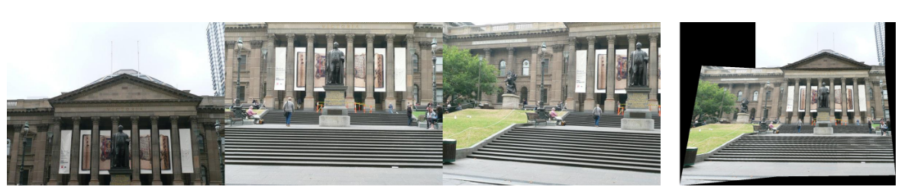
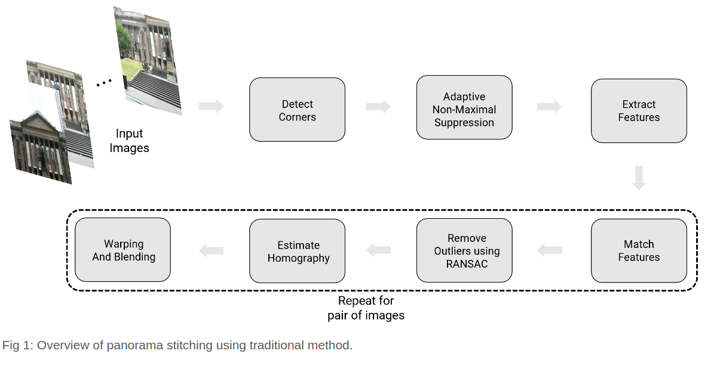
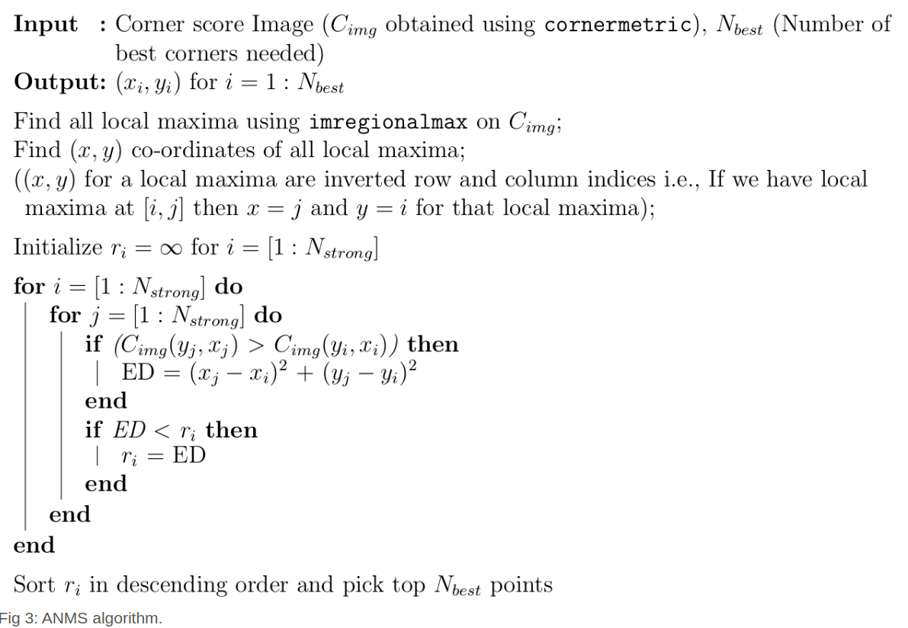
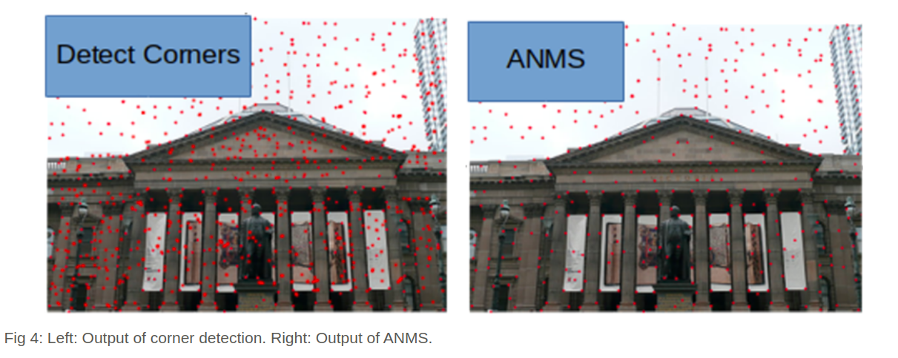
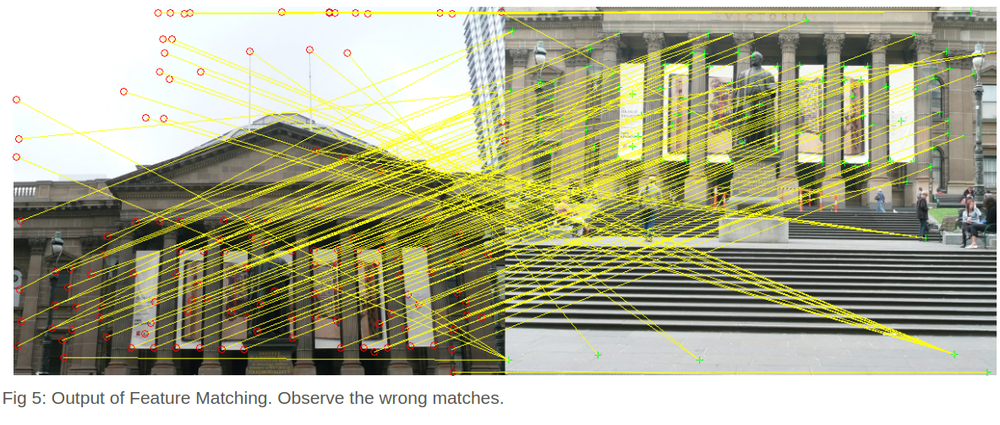
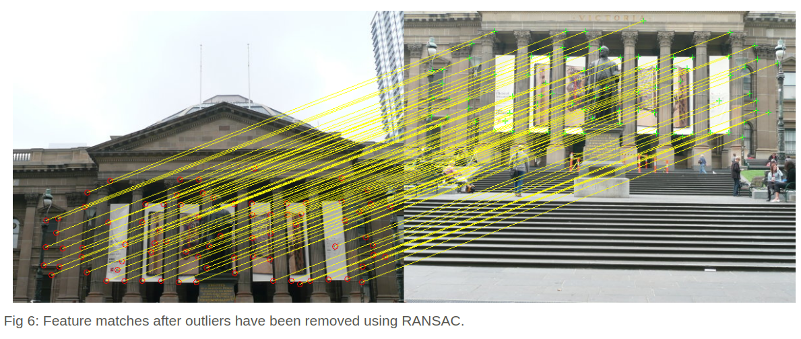
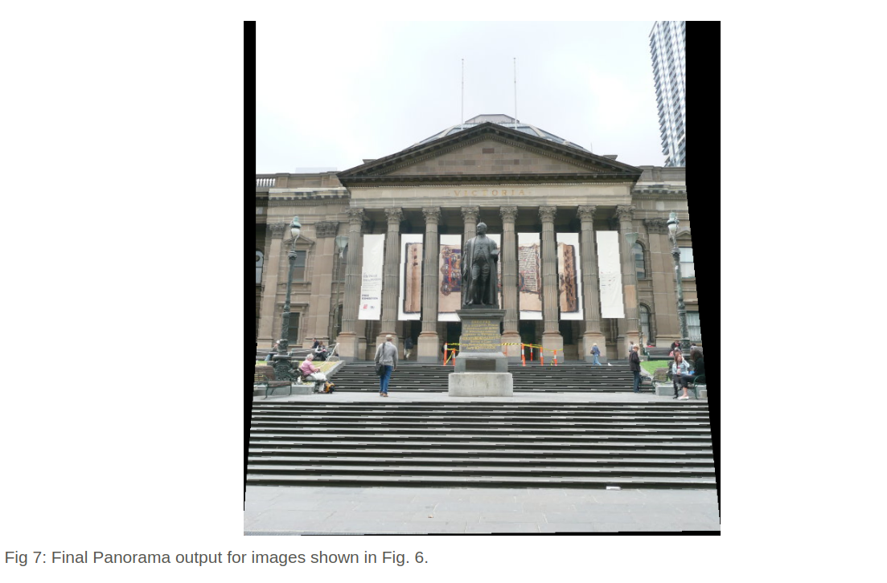
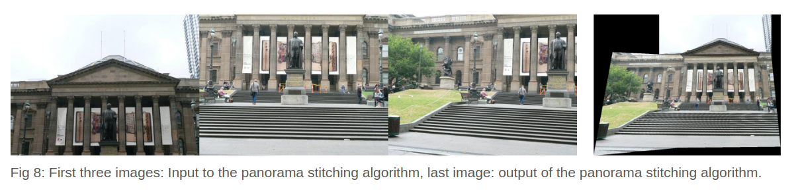

# Panorama Image

# Introcduction

The purpose of this project is to stitch two or more images in order to create one seamless panorama image. Each image should have few repeated local features (∼ 30-50% or more, emperically chosen). The following method of stitching images should work for most image sets.

# Data Set

You need to capture two sets of images in order to stitch a seamless panorama. Each sequence should have at-least 3 images with ∼ 30-50 % image overlap between them. Feel free to check the sample images given to you in Data\Train\ folder.

# Classical Approach

An overview of the panorama stitching using the traditional approach is given below.

## Corner Detection

The first step in stitching a panorama is extracting corners like most computer vision tasks. Here we will use either Harris corners or Shi-Tomasi corners. We use cv2.cornerHarris or cv2.goodFeaturesToTrack to implement this part.

## Adaptive Non-Maximal Suppression (ANMS)
The objective of this step is to detect corners such that they are equally distributed across the image in order to avoid weird artifacts in warping.

In a real image, a corner is never perfectly sharp, each corner might get a lot of hits out of the N strong corners - we want to choose only the Nbest best corners after ANMS. In essence, we get a lot more corners than we should! ANMS will try to find corners which are true local maxima. The algorithm for implementing ANMS is given below.

Output of corner detection and ANMS is shown below. Observe that the output of ANMS is evenly distributed strong corners.

## Feature Descriptor

In the previous step, we found the feature points (locations of the Nbest best corners after ANMS are called the feature point locations). we now need to describe each feature point by a feature vector, this is like encoding the information at each feature point by a vector. One of the easiest feature descriptor is described next.

We take a patch of size 40×40 centered (this is very important) around the keypoint/feature point. Then apply gaussian blur. Sub-sample the blurred output (this reduces the dimension) to 8×8. Then reshape to obtain a 64×1 vector. Then we standardize the vector to have zero mean and variance of 1. Standardization is used to remove bias and to achieve some amount of illumination invariance.

## Feature Matching

In the previous step, we encoded each keypoint by 64×1 feature vector. Now, we want to match the feature points among the two images we want to stitch together. In computer vision terms, this step is called as finding feature correspondences between the 2 images. We pick a point in image 1, compute sum of square differences between all points in image 2. Take the ratio of best match (lowest distance) to the second best match (second lowest distance) and if this is below some ratio keep the matched pair or reject it. We repeat this for all points in image 1. We will be left with only the confident feature correspondences and these points will be used to estimate the transformation between the 2 images, also called as Homography. And we use the function cv2.drawMatches to visualize feature correspondences. Below is an image showing matched features.

## RANSAC for outlier rejection and to estimate Robust Homography

We now have matched all the features correspondences but not all matches will be right. To remove incorrect matches, we will use a robust method called Random Sample Concensus or RANSAC to compute homography.

The RANSAC steps are:

- Select four feature pairs (at random), pi from image 1, pi′ from image 2.
- Compute homography H between the previously picked point pairs.
- Compute inliers where SSD(p′i,Hpi)<τ, where τ is some user chosen threshold and SSD is sum of square difference function.
- Repeat the last three steps until we have exhausted Nmax number of iterations (specified by user) or we found more than some percentage of inliers (Say 90% for example).
- Keep largest set of inliers.
- Re-compute least-squares H^ estimate on all of the inliers.

The output of feature matches after all outliers have been removed is shown below.

## Blending Images

Panorama can be produced by overlaying the pairwise aligned images to create the final output image. The output panorama stitched from two images shown in the Fig. 6 are shown below.

An input and output of a seamless panorama of three images are shown below.

# Appendix

Note1: For the full project description click [here](https://cmsc733.github.io/2020/proj/p1/).

Note2: For the full documentation click [here](https://github.com/hsouri/ResNet-ResNeXt-DenseNet/blob/master/Report.pdf).

